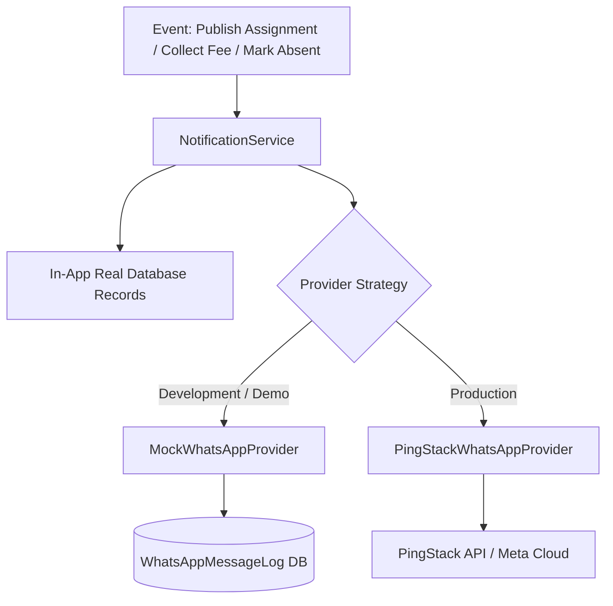

# NEXORA System Architecture

## Multi-Tenant Domain Hierarchy

NEXORA organizes institution data through a normalized hierarchical tenant model:

```
Institution
├── Campus (Main Academic Campus, Sports Complex)
│   ├── AcademicYear (e.g. 2026-2027)
│   │   ├── Term (Term 1 Autumn, Term 2 Spring)
│   │   ├── Department (Science, Mathematics, Humanities, Commerce)
│   │   │   ├── Class (Grade 6, Grade 7, Grade 8, Grade 9, Grade 10, Grade 11, Grade 12)
│   │   │   │   └── Section (A, B, C)
│   │   │   │       ├── ClassTeacher (Teacher assignment)
│   │   │   │       ├── Student (Enrollments & demographics)
│   │   │   │       ├── TimetableSlot (Periods 1-7, Mon-Sat)
│   │   │   │       └── StudentAttendance (Daily roll-call)
```

## Security & Authorization Model

1. **Tenant Isolation**: Every database query scopes `institutionId` to prevent cross-institution data leakage.
2. **Role Capability Enforcement**: Implemented in `src/lib/auth.ts` and `src/lib/permissions.ts`. Operations such as collecting fees, approving leaves, and posting assignments verify permissions server-side.
3. **Data Protection**:
   - Salary records are hidden from unauthorized faculty.
   - Parents can only access records of their assigned children (`StudentGuardian` mapping).
   - Students can only view their own timetable, homework, and marks.

## Notification & PingStack Provider Subsystem


